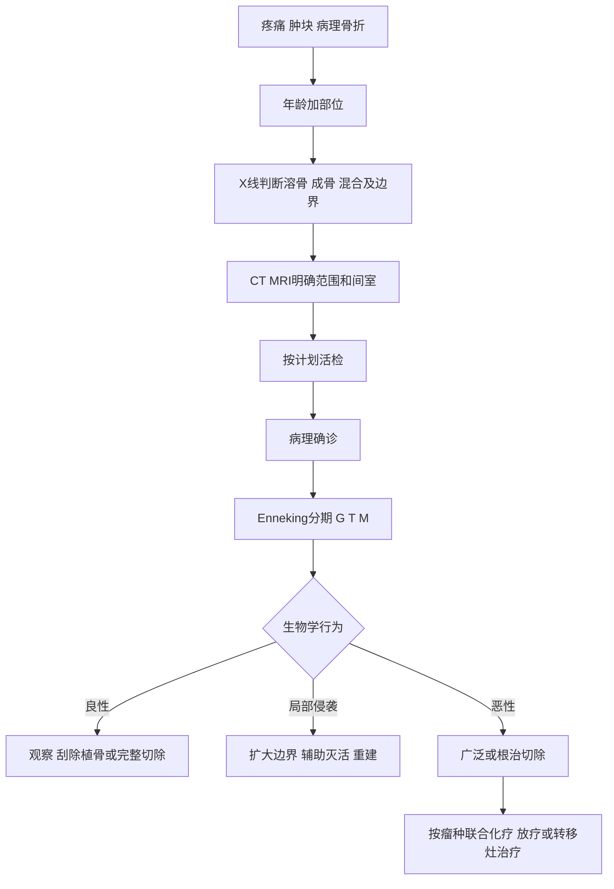

# 第73章核心框架
> **一句话总览：** 骨肿瘤诊断必须坚持“临床—影像—病理”三结合，并以年龄、部位、影像侵袭性和规范活检定性，再用Enneking分期决定手术边界及化疗、放疗和保肢策略。（教材第758—770页）

**前置知识：** [[02-骨折总论]]——病理性骨折是骨肿瘤常见首发表现或并发症
**相关内容：** [[12-骨与关节化脓性感染]]——骨髓炎可模拟恶性骨肿瘤；[[13-骨与关节结核]]——脊柱结核与脊柱肿瘤鉴别
# 总览图

# 诊断总原则
## 年龄、部位和症状
良性原发性骨肿瘤多于恶性；良性常见骨软骨瘤、软骨瘤，恶性常见骨肉瘤、软骨肉瘤。骨肉瘤多见青少年，骨巨细胞瘤多见成人；多发于长骨生长活跃的干骺端。（教材第758页）
恶性倾向包括持续加重和夜间痛、迅速肿胀、皮温高和浅静脉怒张；良性通常缓慢、无痛，但骨样骨瘤可剧痛。轻伤引起病理性骨折可为首发；==创伤帮助发现肿瘤，但不会导致肿瘤==。（教材第758页）
> [!example] “侦查—地图—身份证”类比
> 症状和体检像侦查线索，X线/CT/MRI像绘制肿瘤地图，病理则是确认身份。只看“地图”能判断危险和范围，却不能最终定性；活检又必须沿未来可一并切除的路径规划，否则像调查时把污染带扩散到新的间室。

## 良恶性影像比较

| 维度 | 良性倾向 | 恶性倾向 |
|---|---|---|
| 边界 | 清楚 | 模糊、不规则 |
| 密度 | 较均匀 | 不均匀，虫蛀样或筛孔样 |
| 生长 | 膨胀性或外生性 | 侵袭性、可突破皮质进入软组织 |
| 反应骨 | 周围硬化可见 | 可见侵袭性骨膜反应，或高速溶骨而反应少 |
| 特征征象 | 点状、环状、片状骨化可见 | Codman三角、葱皮样、日光射线等 |

Codman三角多见骨肉瘤；葱皮样多见尤因肉瘤；日光射线来自肿瘤骨和反应骨沿放射状血管沉积。前列腺癌骨转移可表现成骨反应。（教材第758—760页）
## 影像、病理和生化
- X线：基本骨与软组织改变，分溶骨、成骨和混合型。
- CT/MRI：确定存在、范围、侵袭程度、邻近关系，帮助手术规划。
- ECT：较早发现骨转移和病损范围；DSA显示血供；超声评估软组织及骨外肿块。
- 病理是最后确诊的唯一可靠检查。闭合穿刺活检干扰间室少；切开活检会扩大污染，体积小者可选切除式活检。
- 广泛溶骨可高钙；碱性磷酸酶反映成骨活动，骨肉瘤可升高。（教材第760页）
> [!warning] 活检不是独立于手术规划的小操作
> 不正确切开活检会污染正常组织、扩大切除范围，甚至成为保肢禁忌因素。应先完成影像分期和路径规划，再取材。（教材第760—762页）

# Enneking分期与外科边界
外科分期综合G（分级）、T（解剖范围）与M（转移）。G0良性，G1低度恶性，G2高度恶性；T0囊内、T1间室内、T2间室外；M0无转移、M1有转移。良性分静止、活动、侵袭三期；恶性Ⅰ为低度无转移、Ⅱ为高度无转移、Ⅲ为有转移，A为间室内、B为间室外。（教材第760—761页）

| 手术边界 | 切除平面 | 典型方式 |
|---|---|---|
| 囊内 | 病损内 | 囊内刮除 |
| 边缘 | 反应区—囊外 | 边缘整块切除 |
| 广泛 | 超越反应区，经正常组织 | 广泛整块切除 |
| 根治 | 正常组织，清除整个受累间室 | 根治整块切除/离断 |

良性常用刮除植骨；骨软骨瘤等外生肿瘤需完整切除肿瘤骨、软骨帽与软骨外膜。恶性保肢关键是按合理边界完整切除；主要神经血管受侵、病理性骨折造成广泛污染、软组织条件差或错误活检污染均可妨碍保肢。骨肉瘤等围手术期新辅助化疗为标准流程；尤因肉瘤对放疗敏感，而骨肉瘤不敏感。（教材第760—762页）
# 良性骨肿瘤

| 肿瘤 | 好发与影像 | 临床特点 | 治疗 |
|---|---|---|---|
| 骨样骨瘤 | 儿童少年、下肢长骨；<1cm瘤巢被反应骨包围，CT有助定位 | 夜痛、进行性痛，阿司匹林可镇痛 | 彻底清除瘤巢及外围骨 |
| 骨软骨瘤 | 青少年、长骨干骺端；皮质和髓腔与母骨连续，表面软骨帽 | 常无症状；骨骺闭合后停止生长 | 多观察；症状、功能影响、压迫、骨折、复发感染或恶变风险时完整切除 |
| 软骨瘤 | 手足管状骨；髓腔椭圆透亮区、斑点钙化 | 无痛肿胀、畸形或病理骨折 | 刮除或病段切除植骨 |

骨软骨瘤稳定后再生长、疼痛肿胀、骨破坏、云雾状改变或不规则钙化提示恶变；切除需包括纤维膜/滑囊、软骨帽和基底周围正常骨，以防复发。（教材第762—763页）
# 骨巨细胞瘤
为交界性或行为不确定肿瘤，巨细胞瘤本身良性但局部侵袭；好发20～40岁，股骨远端和胫骨近端常见。典型X线为骨端偏心、溶骨性囊性破坏、无骨膜反应，膨胀和皮质变薄呈肥皂泡样。（教材第764页）
> [!example] “肥皂泡不等于温顺”
> 病灶虽呈边界较清的膨胀性“肥皂泡”，仍可能局部侵袭、穿破皮质和造成病理骨折。良性病理标签不能代替对局部行为和外科边界的判断。

Jaffe分级从Ⅰ到Ⅲ表现为基质细胞增多、核分裂和异型性增强，多核巨细胞减少；Ⅰ良性、Ⅱ中间、Ⅲ恶性，但病理分级与行为和影像并非完全一致。治疗以切除加灭活和植骨/骨水泥为主，易复发；复发者扩大切除或假体重建。化疗无效，脊柱等困难部位放疗后有肉瘤变风险；地舒单抗可用于难治性病例。（教材第764—765页）
# 原发性恶性骨肿瘤

| 肿瘤 | 人群/部位 | 关键影像或临床 | 治疗敏感性与策略 |
|---|---|---|---|
| 骨肉瘤 | 青少年；股骨远端、胫骨近端、肱骨近端干骺端 | 持续夜痛、肿块、静脉怒张；Codman三角/日光射线，成骨溶骨混合 | 术前大剂量化疗→根治切除保肢或截肢→术后化疗；肺转移可切除；放疗不敏感 |
| 软骨肉瘤 | 成人老年；骨盆最多 | 缓慢痛肿；溶骨破坏伴钙化斑、絮状骨化或云雾状 | 手术为主，放疗不敏感 |
| 骨纤维肉瘤 | 长骨干骺端偏骨干，股骨多 | 虫蚀样溶骨、边界不清，少骨膜反应 | 广泛/根治切除或截肢；化放疗不敏感 |
| 尤因肉瘤 | 儿童；长骨骨干、骨盆、肩胛 | 低热、白细胞和ESR升高；虫蛀溶骨、葱皮样反应 | 放疗和化疗敏感，但易早转移；放化疗加手术 |
| 骨原发性淋巴瘤 | 40～60岁 | 广泛不规则溶骨、融冰征，少骨膜反应 | 放疗化疗首选，手术辅助 |
| 骨髓瘤 | >40岁男性；脊柱、骨盆、肋骨、颅骨、胸骨 | 多发溶骨、贫血、肾损、高钙；异常浆细胞、M蛋白、Bence-Jones蛋白 | 化疗基础，局部放疗；脊髓压迫先减压后放疗，可考虑造血干细胞移植 |
| 脊索瘤 | 胚胎脊索残余；骶尾最多 | 中轴单腔中心性溶骨、软组织块伴钙化，无骨膜反应 | 手术为主，残留/不可切除可放疗，化疗无效且复发高 |

（教材第765—767页）
# 转移性骨肿瘤
多见40～60岁，偏躯干骨；常见原发依次为乳腺癌、前列腺癌、肺癌、肾癌。表现为疼痛、肿胀、病理性骨折和脊髓压迫。X线以溶骨性较多：甲状腺癌、肾癌偏溶骨，前列腺癌偏成骨；骨扫描敏感。溶骨性转移可高钙，成骨性可碱性磷酸酶升高，前列腺癌骨转移可酸性磷酸酶升高。治疗通常姑息，但应积极综合治疗以延寿、减症和改善生活质量。（教材第767页）
# 瘤样病变及其他良性疾病

| 疾病 | 典型线索 | 治疗 |
|---|---|---|
| 单纯骨囊肿 | 儿童青少年；干骺端界清单/多房溶骨，邻生长板但不跨越；常以病理骨折就诊 | 刮除植骨；<14岁且近骨骺慎手术；囊内甲泼尼龙可用 |
| 动脉瘤性骨囊肿 | 青少年；偏心气球样膨胀、蜂窝/泡沫样，内含血液 | 刮除植骨，术前防大出血；难切部位可放疗，但儿童有骨骺损害和恶变风险 |
| 骨嗜酸性肉芽肿 | 青少年；颅骨、肋骨、脊柱等，孤立界清溶骨；椎体可扁平 | 刮除植骨或放疗 |
| 骨纤维发育不良 | 10～25岁；磨砂玻璃样，股骨近端可牧羊人手杖畸形 | 刮除植骨、节段切除或截骨矫形 |
| 滑膜性软骨化生 | >40岁、膝多；多个钙化游离体，活动时交锁 | 广泛滑膜切除和游离体摘除 |
| 色素沉着绒毛结节性滑膜炎 | 20～40岁、膝髋；肿胀轻痛、滑膜海绵感、关节积液征阳性；可侵蚀骨，亦可累及腱鞘，手屈肌腱鞘可形成孤立硬韧结节；积液呈血性或黄褐色 | 首选切除肿瘤包块或受累滑膜；弥漫病变切除不彻底易复发，无法彻底切除时术后辅以放疗 |

（教材第768—770页）
# 易错点

| 易错说法 | 正确认识 |
|---|---|
| 轻伤后发现骨肿瘤说明创伤致癌 | 创伤不会导致肿瘤，只可能促使病变被发现或诱发病理骨折 |
| 所有良性肿瘤都无痛 | 骨样骨瘤可夜间剧痛，阿司匹林常能缓解 |
| 病理活检只要能取到组织即可 | 活检通道会污染间室，必须结合最终切除规划 |
| 葱皮样骨膜反应最典型见骨肉瘤 | 葱皮样多见尤因肉瘤；Codman三角和日光射线常提示骨肉瘤 |
| 肥皂泡样说明骨巨细胞瘤完全良性 | 可局部侵袭、突破皮质和复发，病理分级与行为并非完全一致 |
| 骨肉瘤与尤因肉瘤都对放疗敏感 | 尤因肉瘤敏感；骨肉瘤不敏感 |
| 转移瘤都为溶骨性 | 前列腺癌骨转移常为成骨性，也可有混合型 |

# 折叠自测
> [!question]- 骨肿瘤确诊的“三结合”和最终可靠检查分别是什么？
> 临床、影像学、病理学三结合；病理组织学检查是最后确诊的唯一可靠检查。（教材第758—760页）
> [!question]- G、T、M各代表什么？
> G为外科分级/生物学恶性度，T为解剖范围（囊内、间室内、间室外），M为有无区域或远处转移。（教材第760页）
> [!question]- 如何用年龄和部位区分骨肉瘤、骨巨细胞瘤和尤因肉瘤？
> 骨肉瘤多青少年、长骨干骺端；骨巨细胞瘤多20～40岁、骨端偏心且常见股骨远端/胫骨近端；尤因肉瘤多儿童、长骨骨干或骨盆肩胛。（教材第758、764—766页）
> [!question]- 骨软骨瘤哪些变化提示需手术或警惕恶变？
> 生长过快、疼痛、功能影响、邻骨/关节畸形、神经血管压迫、自身骨折、滑囊反复感染、病变活跃或稳定后再生长并出现破坏和不规则钙化。（教材第763页）

# 相关笔记
- [[12-骨与关节化脓性感染]]——尤因肉瘤可伴低热、白细胞和ESR升高，需与骨髓炎鉴别
- [[13-骨与关节结核]]——脊柱肿瘤常保留椎间隙，而结核常破坏椎间盘并形成寒性脓肿
- [[11-颈腰椎退行性疾病]]——脊柱肿瘤疼痛进行性且休息不缓解，可不同于退变性疼痛
# 来源范围
- 人民卫生出版社《外科学》第10版，第七十三章“骨肿瘤”，教材第758—770页。
- 内容依据：已下载教材PDF中文文本层；仅修正断行、异常空格和明显字符错误，未补造教材未述数据。
